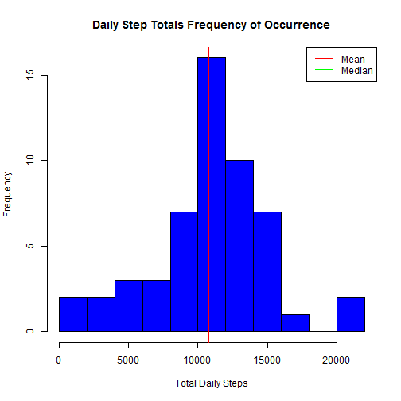
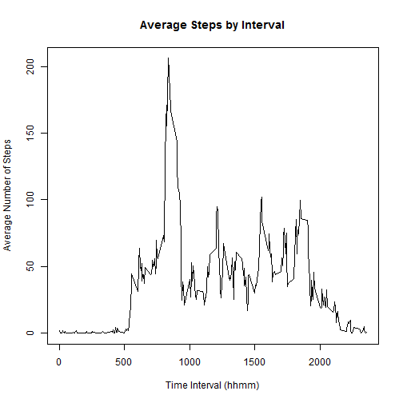
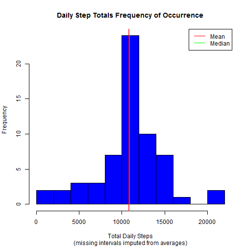
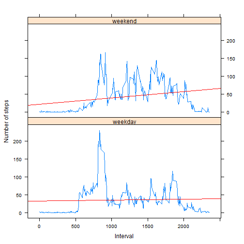

## Loading and preprocessing the data

The dataset is provided as a three-column, 17,568-row CSV file with this simple data dictionary:

|column |definition|
|:------|:----------|
|steps|number of steps measured for interval|
|date|calendar date of observation|
|interval|5-minute interval of observation, encoded as an integer representing hour and minute (hhmm)|

The dataset is read in as follows (after being extracted from its ZIP archive if nececessary).  Other than defining column classes, no further preprocessing or cleaning is performed at this point.  


```r
if (!file.exists("activity.csv")) {
    unzip("activity.zip")
}

activity <- read.csv("activity.csv", colClasses=c("integer", "character", "integer"))
str(activity)
```

```
## 'data.frame':	17568 obs. of  3 variables:
##  $ steps   : int  NA NA NA NA NA NA NA NA NA NA ...
##  $ date    : chr  "2012-10-01" "2012-10-01" "2012-10-01" "2012-10-01" ...
##  $ interval: int  0 5 10 15 20 25 30 35 40 45 ...
```


## What is mean total number of steps taken per day?

We note that there are missing values for certain observation intervals (coded as NA).  Initially, we will analyze the data with missing values excluded, as follows:


```r
activity.clean <- activity[complete.cases(activity),]
str(activity.clean)
```

```
## 'data.frame':	15264 obs. of  3 variables:
##  $ steps   : int  0 0 0 0 0 0 0 0 0 0 ...
##  $ date    : chr  "2012-10-02" "2012-10-02" "2012-10-02" "2012-10-02" ...
##  $ interval: int  0 5 10 15 20 25 30 35 40 45 ...
```

We will examine the total number of steps recorded on each day by creating a histogram of this series and calculating its mean and median.


```r
library(dplyr)
daysum <- activity.clean %>%
          group_by(date) %>% 
          summarise(steps=sum(steps))

hist(daysum$steps, breaks=10, col="blue", main="Daily Step Totals Frequency of Occurrence", 
     xlab="Total Daily Steps")

meansteps <- mean(daysum$steps)
mediansteps <- median(daysum$steps)
# add a jitter to the median line to show it next to the mean:
abline(v=jitter(mediansteps), col="green")
abline(v=meansteps, col="red")
legend("topright", lwd=1, col=c("red", "green"), legend=c("Mean", "Median"))
```

 

```r
print(meansteps)
```

```
## [1] 10766
```

```r
print(mediansteps)
```

```
## [1] 10765
```

The mean total number of steps taken per day is $10766.2$ while the median is $10765$.  The mean and median are essentially the same; a slight "jitter" had been added to the median in the plot in order to show it next to the mean; otherwise, the line drawn last would be the only one visible.


## What is the average daily activity pattern?
Next, we analyzed the average number of steps taken in each of the 288 intervals in a day, averaged across all days.  

$\frac{(24 \text{ hrs/day}) * 60 \text{ min}}{5 \text{ min/interval}} = 288 \text{ intervals/day}$


```r
# still using dplyr
interval.avgs <- activity.clean %>% 
                 group_by(interval) %>% 
                 summarise(avgsteps = mean(steps))

with(interval.avgs, plot(interval, avgsteps, type="l", 
                         main="Average Steps by Daily Time Interval", 
                         xlab="Time Interval (hhmm)", ylab="Average Number of Steps"))
```

 

```r
# condense the interval series to one row with the maximum observed value:
maxint <- filter(interval.avgs, avgsteps==max(avgsteps))
print(maxint)
```

```
## Source: local data frame [1 x 2]
## 
##   interval avgsteps
## 1      835    206.2
```

The interval with the maximum average number of steps occurs at $835$ with a value of $206.17$ steps.  This result agrees with the prominent morning peak in the plot above (which, we can speculate, reflects the subject's daily routine, perhaps his/her commute to work or morning fitness activity).

## Imputing missing values

As noted above, the dataset as provided has missing values for certain observations in the overall series.  


```r
missing <- sum(!complete.cases(activity))
print(missing)
```

```
## [1] 2304
```

There are $2304$ missing observations in the $17568$ rows.  Obviously, the precise effect of missing values (wrt what would have ideally been observed in a complete set of observations) is unknowable, but we will explore the question by substituting ("plugging") estimated values for the missing observations and re-analyzing the resulting dataset.  We will replace each missing value with average for that interval across all days (as calculated above).


```r
activity.na <- filter(activity, is.na(steps))

# create a dataset of "plugged" values only
activity.plug <- activity.na %>%
                 inner_join(interval.avgs) %>%
                 transmute(interval=interval, steps=avgsteps, date=date)
```

```
## Joining by: "interval"
```

```r
# reassemble the complete series with clean and plugged values
activity.fix <- rbind(activity.clean, activity.plug)
str(activity.fix)
```

```
## 'data.frame':	17568 obs. of  3 variables:
##  $ steps   : num  0 0 0 0 0 0 0 0 0 0 ...
##  $ date    : chr  "2012-10-02" "2012-10-02" "2012-10-02" "2012-10-02" ...
##  $ interval: int  0 5 10 15 20 25 30 35 40 45 ...
```

```r
sum(complete.cases(activity.fix))
```

```
## [1] 17568
```

In this way, we have assembled a complete series of $17568$ observations from the $15264$ complete observations and the $2304$ averages substituted for missing values.

Here, we re-create the first analysis from above, now applied to the complete series with missing data filled-in using invterval averages:


```r
daysum2 <- activity.fix %>%
           group_by(date) %>% 
           summarise(steps=sum(steps))

hist(daysum2$steps, breaks=10, col="blue", main="Daily Step Totals Frequency of Occurrence", 
     xlab="Total Daily Steps")

meansteps2 <- mean(daysum2$steps)
mediansteps2 <- median(daysum2$steps)
abline(v=jitter(mediansteps2), col="green")
abline(v=meansteps2, col="red")
legend("topright", lwd=1, col=c("red", "green"), legend=c("Mean", "Median"))
```

 

```r
print(meansteps2)
```

```
## [1] 10766
```

```r
print(mediansteps2)
```

```
## [1] 10766
```

For the dataset with filled-in values, the mean number of daily steps is $10766.2$ and the median is $10766$, both of which are practically identical to  the corresponding values computed on the dataset of complete observations (see above).  This is not a surprising result: by adding means of the component intervals as missing values, we do not change the means of their sums. 

As an aside, it is interesting to note that the missing data occurs in a pattern of entire days, not intervals within a day for which observations were recorded:

```r
# dates with any data missing
days.missing <- activity %>%
                filter(is.na(steps)) %>%
                select(date) %>%
                distinct
# dates with any data found
days.found <- activity.clean %>%
              select(date) %>%
              distinct
# days with some missing, some present data would be here
days.mixed <- intersect(days.missing$date, days.found$date)
print(length(days.mixed))

```

So, there are no days with some observations missing and some provided; observations are complete or not only on a day-by-day basis.  In this way, we see that the data manipulation done here fills in missing days with the sum of the average of the 288 intervals:


```r
interval.avgs.sum <- sum(interval.avgs$avgsteps)
print(interval.avgs.sum)
```

```
## [1] 10766
```

The sum of the average intervals is $10766.2$, which is (unsurprisingly) the same as the average of the intervals summed by day.  The conclusion is that this approach to filling in missing data does nothing to change the overall analysis, since the estimate of the total daily number of steps is the same; it will, however, tend to reduce the effect analyzed in the next part, weekday vs. weekend activity levels, since plugging average values is insensitive to weekday vs. weekend.  A more sophisticated fill-in approach might take this difference into account use weekend or weekday averages of known values depending on the day being filled in.

## Are there differences in activity patterns between weekdays and weekends?

Finally, we analyzed whether there are any differences in the pattern of daily activity for weekdays compared to weekends.  Again we compute the average by interval, this time binned by weekday vs. weekend.


```r
# lubridate makes for nice literate date manipulation
library(lubridate)

# add a factor column categorizing by weekend vs. weekday
activity.fix <- mutate(activity.fix, 
                       weekpart= as.factor(ifelse(wday(date,label=TRUE) %in% c("Sat","Sun"),
                       "weekend", "weekday")))

# summarize by inteval and weekday/weekend
interval.avgs.byweekpart <- activity.fix %>% 
                            group_by(interval, weekpart) %>% 
                            summarise(avgsteps = mean(steps))

# lattice is a natural choice for panel plots
library(lattice)       
weekpart.plot <- xyplot(avgsteps ~ interval | weekpart, data=interval.avgs.byweekpart, layout=c(1,2), 
                        ylab="Number of steps", xlab="Interval", type="l",
                        panel = function(x, y, ...) {
                            panel.xyplot(x, y, ...)
                            panel.lmline(x, y, col="red")
                        })
print(weekpart.plot)                        
```

 

We have overlaid a simple linear regression line on each plot panel; this is something of a "blunt instrument" for understanding this type of measurement which clearly has more in play than a simple linear relation with time, but it does accentuate the difference between the two cases.  On weekdays, the subject typically has a sharp peak of activity in the morning followed by much more sedentary readings throughout the day punctuated by smaller peaks in activity in the afternoon and evening.  Activity on the typical weekend is more evenly distributed throughout the day and also occurs at a higher level:


```r
weekpart.summary <- activity.fix %>%
                    group_by(date, weekpart) %>% 
                    summarise(steps=sum(steps)) %>% 
                    group_by(weekpart) %>% 
                    summarise(avgsteps = mean(steps))
print(weekpart.summary)
```

```
## Source: local data frame [2 x 2]
## 
##   weekpart avgsteps
## 1  weekday    10256
## 2  weekend    12202
```

```r
weekday.avg <- weekpart.summary %>% filter(weekpart=="weekday") %>% select(avgsteps) %>% unlist
weekend.avg <- weekpart.summary %>% filter(weekpart=="weekend") %>% select(avgsteps) %>% unlist
```

On weekdays, the subject took an average of $10255.8$ steps, while his/her weekend average was $12201.5$ or $19\%$ more.
